# BYD Energy Integration - API Polling & Performance Architecture

This document details the multi-rate scheduling architecture implemented within the Home Assistant custom component.

Because the BYD Energy Cloud API separates metrics into targeted, independent REST endpoints instead of a single unified telemetry bundle, querying all metrics at high frequency is inefficient and carries a risk of account throttling or IP bans.

---

## ⏱️ Polling Loop Architecture & Decoupled REST Endpoints

To optimize performance, the integration classifies telemetry queries into three separate execution bands (Fast, Medium, and Slow). Each loop calls distinct REST paths returning highly targeted payloads:

```mermaid
graph TD
    A[BydEnergyDataUpdateCoordinator] -->|Every 15s| B(Fast Loop)
    A -->|Every 5m| C(Medium Loop)
    A -->|Every 12h| D(Slow Loop)

    B -->|Flow diagram / Live views| B1["/RealtimeConfig/GetRealtimeDataList (type='sys')"]
    B -->|MPPT instantaneous| B2["/PV/GetPvRealtimes"]
    B -->|Online ping| B3["/Product/GetProductOnlineState"]

    C -->|AC line details| C1["/RealtimeConfig/GetRealtimeDataList (type='pcs')"]
    C -->|BMS SOH & Limits| C2["/RealtimeConfig/GetRealtimeDataList (type='batterySystem')"]
    C -->|Cell diagnostics| C3["/RealtimeConfig/GetRealtimeDataList (type='bms')"]
    C -->|Grid meters| C4["/RealtimeConfig/GetRealtimeDataList (type='eleme')"]
    C -->|Today counters| C5["/HistoryRealtime/GetTodayEleData"]
    C -->|Lifetime counters| C6["/HistoryRealtime/GetTotalEleDataNew"]
    C -->|EEPROM Settings| C7["/RealtimeConfig/GetDeviceEepromSettings"]

    D -->|Installation date| D1["/DeviceSetting/GetDeviceBaseSettings"]
    D -->|Grid Standards| D2["/DeviceSetting/GetDeviceSettings"]
    D -->|BMS Platform| D3["/Upgrade/GetBmsType"]
    D -->|Firmware checks| D4["/Upgrade/GetCurrentUpgradeAreaVersion & /LatestVersion"]
```



---

## ⚡ Loop Specifications & Endpoint Payload Mapping

### 1. Fast Loop
* **Default Frequency**: `15 seconds` (Configurable via Home Assistant Config/Options Flow between `5s` and `300s`).
* **Purpose**: Maintains real-time responsiveness of the Home Assistant Energy Dashboard and live power flow cards.
* **Endpoints & Payloads**:
  1. **`/RealtimeConfig/GetRealtimeDataList` (display type: `sys`)**:
     * *Payload returned*: targeted array containing live active flows (`pvPow`, `lPow`, `battPow`, `me1Pow`).
     * *Size*: ~250 bytes.
  2. **`/PV/GetPvRealtimes`**:
     * *Payload returned*: Instantaneous PV string 1 & PV string 2 voltages/currents.
     * *Size*: ~180 bytes.
  3. **`/Product/GetProductOnlineState`**:
     * *Payload returned*: A single boolean indicating cloud connectivity.
     * *Size*: ~80 bytes.

### 2. Medium Loop
* **Default Frequency**: `5 minutes` (Configurable via Home Assistant Options Flow between `60s` and `3600s`).
* **Purpose**: Queries large static registers, battery State of Health, designs, cycle counts, and active EEPROM tables.
* **Endpoints & Payloads**:
  1. **`/RealtimeConfig/GetRealtimeDataList` (display type: `pcs`)**: Inverter AC line metrics (AC voltage, backup/EPS output power).
  2. **`/RealtimeConfig/GetRealtimeDataList` (display type: `batterySystem`)**: Battery SOH, tower parallel counts, module quantities, and allowable charge/discharge envelopes.
  3. **`/RealtimeConfig/GetRealtimeDataList` (display type: `bms`)**: Granular cell-voltage bounds, loop counts, temperatures.
  4. **`/RealtimeConfig/GetRealtimeDataList` (display type: `eleme`)**: Grid and battery daily/lifetime charge counters.
  5. **`/HistoryRealtime/GetTodayEleData`**: Daily aggregated solar and consumption energy totals.
  6. **`/HistoryRealtime/GetTotalEleDataNew`**: Lifetime accumulated energy totals.
  7. **`/RealtimeConfig/GetDeviceEepromSettings`**: Decodes internal registers of the Inverter EEPROM table.
  8. **`/Product/GetPvMaxPowerOutput`**: Max string rating limits.

### 3. Slow Loop
* **Default Frequency**: `12 hours` (Configurable via Home Assistant Options Flow between `1h` and `24h`).
* **Purpose**: Gathers static installation settings and checks cloud firmware repositories for updates.
* **Endpoints & Payloads**:
  1. **`/DeviceSetting/GetDeviceBaseSettings`**: Query baseline installation time (`qaTime`).
  2. **`/DeviceSetting/GetDeviceSettings`**: Grid regulations standard compliance (`grid_regulation`).
  3. **`/Upgrade/GetBmsType`**: BMS series platform code.
  4. **`/Upgrade/GetCurrentUpgradeAreaVersion`**: Active firmware version.
  5. **`/Upgrade/app/GetLatestVersion`**: Latest available software version on BYD servers.

---

## 📊 Optimization Mathematics (Cloud Protection Impact)

By separating these endpoints into multi-rate loops, the integration avoids sending redundant, heavy REST queries to the BYD cloud.

### Scenario A: Single-Rate polling (polling all 20 endpoints every 15s)
* **HTTP Requests per cycle**: `20 requests`
* **Requests per hour**: `4,800 requests`
* **Requests per day**: `115,200 requests`
* **Bandwidth consumed**: ~65 MB / day
* **Cloud ban risk**: **CRITICAL** (almost guaranteed to trigger rate limiting).

### Scenario B: Multi-Rate polling (Current Scheduling Architecture)
* **Fast Loop Requests**: `3 requests` every 15s ➔ `17,280 requests` / day.
* **Medium Loop Requests**: `8 requests` every 5 mins ➔ `2,304 requests` / day.
* **Slow Loop Requests**: `9 requests` every 12 hours ➔ `18 requests` / day.
* **Total daily requests**: `19,602 requests`
* **Bandwidth consumed**: ~8.2 MB / day
* **Cloud ban risk**: **EXTREMELY LOW** (highly conservative behavior).

> [!TIP]
> **Performance Recommendation**:
> Keeping the **Medium Loop** at `5 minutes` (`300s`) and the **Slow Loop** at `12 hours` (`43200s`) or more is highly recommended. If these values are decreased significantly inside the **Configure Options Flow**, monitor Home Assistant log files closely for `HTTP 429 (Too Many Requests)` warnings from the cloud server.

---

## 🔄 Write-Through Caching & Deferred State Synchronization

To provide a responsive user experience while maintaining state synchronization across multi-app environments, the integration implements a hybrid state-tracking system:

```
[User Interaction] ──> (Send POST write to Inverter)
      │
      ├──> [Instant Feedback (0s)] ──> Update Local Memory Cache ──> async_write_ha_state()
      │
      └──> [Deferred Cloud Sync (3s)] ──> Bypass 5m check ──> Force GET refresh from Cloud
```

### 1. Instant Local Write-Through (0-Second Feedback)
When modifying a value, toggling a switch, or editing a time slot in Home Assistant, waiting for a network poll to read back the state can feel sluggish. To prevent this:
* As soon as the API client receives an HTTP `200 OK` success response for the POST write call, the integration updates the local coordinator RAM cache with the new target value.
* An immediate local UI refresh (`async_write_ha_state()`) is then triggered, providing instantaneous visual feedback.

### 2. Safety-Delayed Cloud Re-read (3-Second Forced Sync)
Hardware EEPROM registers and cloud databases often experience minor propagation delays before a newly written setting is saved and indexed. To prevent the Home Assistant UI from reading back old cached database values and temporarily reverting the display, the integration triggers a deferred background sync:
* Spawns a background task: `force_medium_refresh_soon()`
* Suspends execution for a **3-second safety delay** in the background.
* Bypasses the `medium_polling_interval` time constraint by resetting `_last_medium_fetch = 0.0`.
* Fires a targeted **GET refresh** of all EEPROM settings directly from the BYD Cloud.

### 3. Pure Read-Only Coexistence & Multi-App Support
This deferred synchronization is designed to be secure:
* **Zero Write Loop Risk**: The background refresh ONLY executes read-only queries (HTTP `GET`). It does not trigger any POST calls or modify any registers.
* **Third-Party App Alignment**: If a user changes a setting on the physical device or through the official BYD mobile application, the deferred GET refresh retrieves the actual, verified hardware value, keeping Home Assistant aligned with the true state of the hardware.
